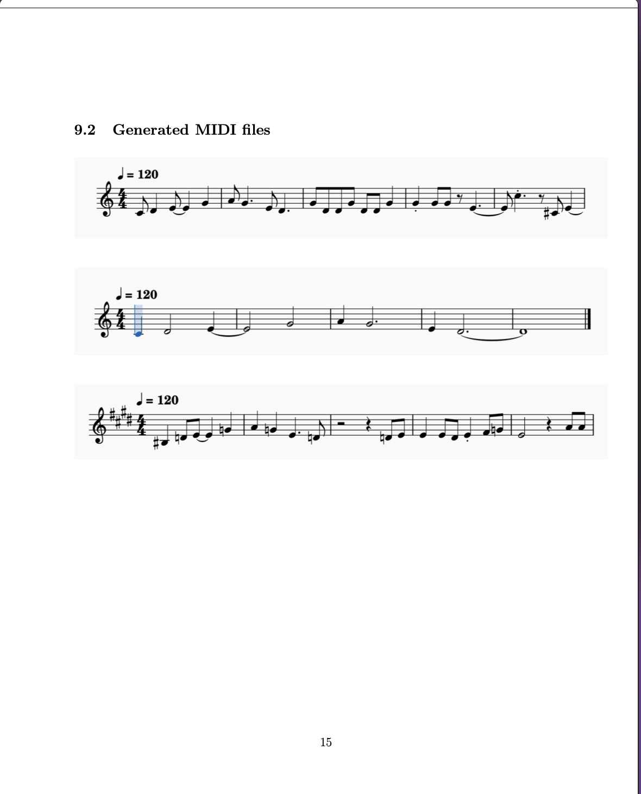

Generative music using RNN based LSTM 
Output:
 
Conclusion:
Conclusion This project has shown a success of LSTM neural network in the creation of Indian
classical music (rag durga and bhairavi), abhogi, kakatiyan style rag(Kedar) In the phase of
model training on MIDI dataset the AI has essentially learned and mimicked the intricacies
melodic patterns and ingrain rhythmic structures found specifically in such ragas. As a result,
we see the prowess computational AI has of not just to preserve but also incubate from within
the space of Indian classical music if any, in a new age evolving compositional manner. Finally,
the project indicates subtler far-reaching consequences AI has when it comes to preserving
culture and with traditional musical experiences opening up new avenues. In addition, with more
sophisticated augmentations of AI and music synthesis we could bring to life such generative
models that sound even more realistic, coherent and extroverted that classical music traditions
will keep on repeating themselves as we are now.